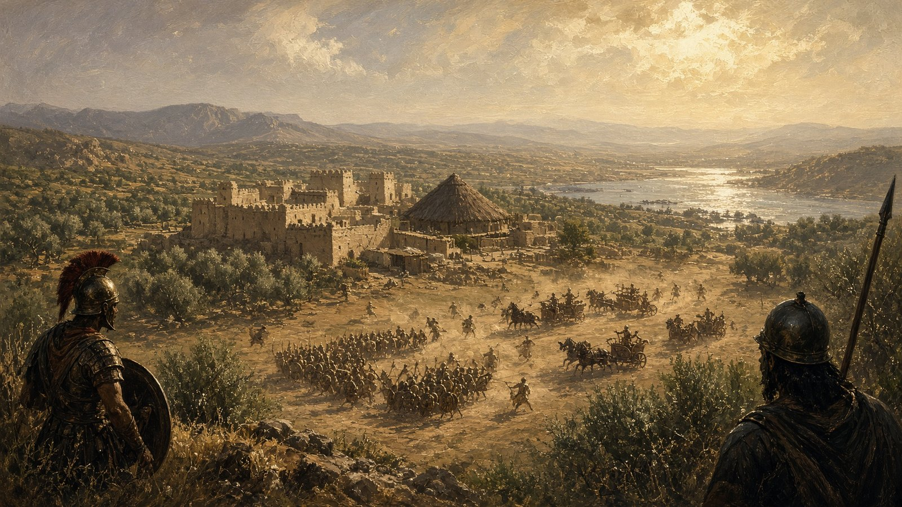
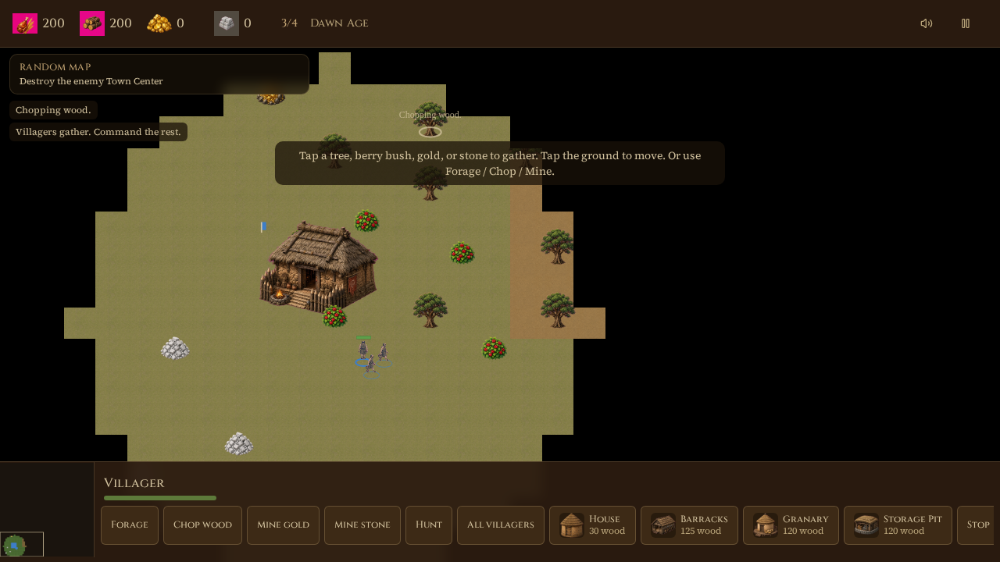

# Dawn of Empires

A browser real-time strategy game in the spirit of *Age of Empires* (1997). Gather food, wood, gold and stone. Raise houses and barracks. Advance through four ages. Train infantry, archers, cavalry, priests and siege, then raze the enemy Town Center.

This is an original homage — not the commercial game, and not affiliated with Microsoft or Ensemble Studios.





## Play

```bash
npm install
npm run dev
```

Open the printed local URL (the dev server listens on port 8080). The title screen lets you pick a civilization, difficulty, a three-mission campaign, or a random map.

```bash
npm run typecheck
npm run build
```

## How it plays

Four resources, four ages, a Town Center, villagers, fog of war, and a rival tribe that gathers, builds, and attacks.

| Age | Unlocks |
| --- | --- |
| Dawn Age | Villagers, Clubmen, Houses, Barracks, Granary, Storage Pit |
| Craft Age | Bowman, Scout, Archery Range, Farm, second Town Center |
| Bronze Age | Swordsman, Cavalry, Stable, Tower, Temple, Market |
| Iron Age | Catapult, Priest, Wall |

### Civilizations

| Civ | Bonus |
| --- | --- |
| Nile Kingdom | Farms yield more. Priests cost less gold. |
| Aegean League | Infantry hit points and attack. |
| Twin Rivers | Cheaper buildings. Towers see farther. |
| Highland Host | Faster cavalry. Cheaper age advances. |

### Campaign

1. **The First Dawn** — gather, house, and train a warband
2. **River Raid** — hold the ford and destroy the rival Town Center
3. **Hearth and Iron** — survive the counter-attack and finish the enemy

Random Map is a seeded duel on a lakes-and-forests board. Destroy the enemy Town Center to win. Lose yours and the game is over.

## Controls

### Mouse

- Left-click selects. Drag a box to select many.
- Right-click (or tap a resource with units selected) issues a smart command: move, gather, attack, or finish a building.
- Double-click a unit to select all of that type. Double-click the Town Center to call every villager.
- WASD / arrows pan. Wheel zooms. `C` centers. `.` finds an idle villager. `Esc` cancels placement.
- With villagers selected: `H` house, `B` barracks, `F` farm, `R` archery, `L` stable, `G` granary, `P` storage pit, `Y` tower, `M` market, `X` wall.

### Tablet / touch (no right-click)

1. Tap a villager, or tap **All villagers**.
2. Tap a tree, berry bush, gold pile, or stone to gather. Tap the ground to move. Tap an enemy to attack.
3. Or use the bottom buttons: **Forage**, **Chop wood**, **Mine gold**, **Mine stone**, **Hunt**.
4. Drag with one finger to pan. Pinch to zoom. Double-tap a villager to select every villager of that type.

## Architecture

TanStack Start + React overlay HUD, custom HTML5 Canvas engine.

```
src/game/engine.ts     simulation, render, input, AI, fog of war
src/game/catalog.ts    units, buildings, ages, civs, missions
src/game/pathfind.ts   8-direction A*
src/game/mapgen.ts     seeded random maps
src/game/audio.ts      Web Audio music and SFX
src/components/game/   title, HUD, app shell
public/game/           tiles, sprites, title painting, resource icons
```

The sim runs on a fixed timestep. The HUD snapshots at a lower rate. Fog is an offscreen canvas. Pathfinding is grid A* with a small cache. The AI gathers, houses, trains, and raids.

## License

MIT. Original code and generated art in this repository. *Age of Empires* remains a trademark of its owners.
